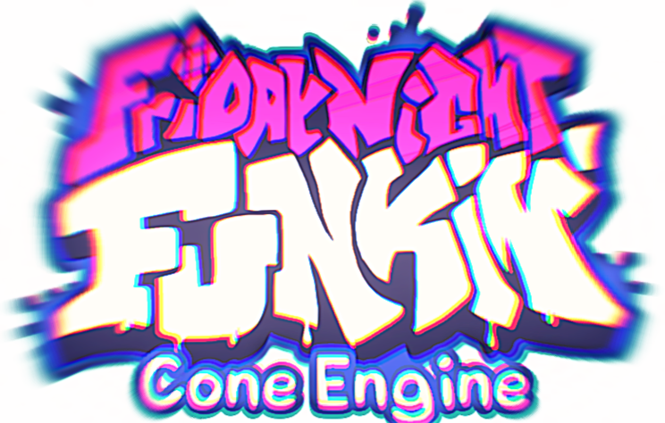

<!---ADD GAMEPLAY GIFS!!!!--->

## A modification of Friday Night Funkin'!

It adds:
* Options Menu
* Downscroll
* Nothing else (for now)

## Credits

* Conecat (Programmer)

### Extra credits

* KadeDev (Downscroll [formula](https://github.com/MaxWasTak3n/Funkin/blob/e2e35d2b26bcd14f76a52f545b24af1d2e8877f0/source/PlayState.hx#L1555))

If you want to contribute, go [here](https://github.com/MaxWasTak3n/Funkin/pulls).  
Or if you want to report an issue, go [here](https://github.com/MaxWasTak3n/Funkin/issues).
